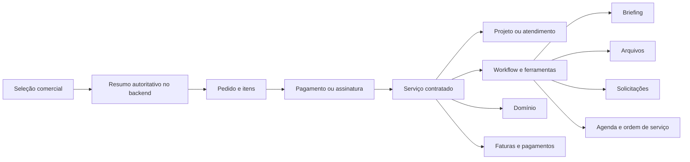

# NEXTIA — Plano de implementação completa pós-auditoria

> Documento de execução técnica e funcional
>
> - Data de elaboração: 14/08/2026
> - Baseline auditada: branch `main`, commit `24b9ed9`
> - Documento-base: `RELATORIO_AUDITORIA_2026-08-04.md`, complementado pela inspeção atual do repositório
> - Hospedagem-alvo: Coolify/Contabo
> - Estado deste documento: planejamento — nenhuma etapa aqui descrita deve ser considerada implementada apenas pela existência deste arquivo

## 1. Objetivo

Corrigir as falhas encontradas na auditoria e consolidar a Nextia em uma plataforma na qual cada contratação tenha identidade própria e rastreável desde a escolha comercial até a execução e a cobrança.

O resultado esperado é que o sistema consiga responder, sem inferências, às seguintes perguntas:

- Qual serviço o cliente contratou?
- Qual segmento e modelo foram escolhidos?
- Qual plano, opcionais, domínio e valores fazem parte da contratação?
- Qual pedido, pagamento, assinatura e fatura originaram o serviço?
- Qual projeto ou atendimento operacional corresponde à contratação?
- Quais ferramentas, formulários, arquivos, etapas e solicitações pertencem a esse serviço?
- O serviço precisa apenas de cliente e administrador ou também de técnico?
- Qual é o estado atual do domínio, briefing, execução, pagamento e entrega?

## 2. Escopo obrigatório

Este plano cobre integralmente:

1. Correção da tela branca do perfil do cliente e do administrador.
2. Criação real das demonstrações `loja-moda-premium`, `loja-gourmet` e `loja-tech-store`.
3. Unificação dos catálogos de modelos usados por `/sites-prontos` e `/lojas-virtuais`.
4. Remoção das estatísticas promocionais estáticas da página pública de parceiros.
5. Cobrança autoritativa de R$ 50,00 quando o cliente escolher registrar um domínio.
6. Discriminação completa do serviço, modelo, plano, opcionais e domínio em pedidos e faturas.
7. Identificação explícita do serviço em projeto, briefing, arquivos, solicitações e demais ferramentas.
8. Suporte correto a múltiplos serviços e projetos simultâneos para o mesmo cliente.
9. Workflows específicos para serviços digitais, automação, bot de WhatsApp, TechCare e infraestrutura.
10. Upload real e seguro de arquivos.
11. Correção dos fluxos de criação de projeto, webhooks e contratos.
12. Migração e saneamento dos registros existentes.
13. Testes, observabilidade, implantação no Coolify e rollback.

## 3. Problemas que a implementação deve eliminar

### 3.1 Problemas críticos

- `ProfilePage` chama `useProject()` fora de `ProjectProvider`, derrubando a renderização de `/perfil`.
- A API devolve apenas `projects[0]`, ocultando todos os demais projetos do cliente.
- Contratos armazenam somente o plano e descartam serviço, modelo, domínio e opcionais.
- Qualquer pedido comercial aprovado pode ser transformado indevidamente em projeto de loja virtual.
- `/api/auth/register` mistura cadastro de conta com criação de projeto e aceita valores enviados pelo navegador.
- O repositório usa `projects.source_order_id` sem possuir migração versionada que garanta a existência da coluna.
- O fallback de projetos mistura último pedido, último contrato e último rascunho, podendo criar contexto incorreto.

### 3.2 Problemas funcionais

- Os três novos modelos de loja possuem apenas metadados e reutilizam a mesma ilustração.
- Slugs de demonstração não implementados caem silenciosamente no restaurante premium.
- `/sites-prontos` e `/lojas-virtuais` usam fontes diferentes de modelos.
- A seleção de registro de domínio não altera o preço.
- O backend ignora `domain`, `domainType`, `templateSlug` e `optionalItems` em contratos.
- Pedidos e faturas exibem somente o nome do plano em parte dos fluxos.
- O briefing mistura perguntas de site e e-commerce e não é escolhido pelo serviço.
- Arquivos e solicitações sempre usam o projeto implícito mais recente.
- O upload de arquivos apenas simula progresso e grava metadados sem enviar o conteúdo.
- A página de parceiros contém estatísticas e depoimentos escritos diretamente no componente.
- A simulação de comissão possui preços divergentes do catálogo comercial atual.

## 4. Princípios obrigatórios da solução

1. **Uma contratação, uma identidade canônica.** Pedido, contrato, projeto, workflow, domínio, arquivos e faturas devem apontar para o mesmo identificador de serviço contratado.
2. **Preço calculado somente no servidor.** O frontend envia identificadores e escolhas; nunca envia valores confiáveis.
3. **Cadastro não é contratação.** Criar usuário não pode criar projeto, pedido ou cobrança implicitamente.
4. **Nenhum fallback silencioso.** IDs inválidos, slugs inexistentes e associações ambíguas devem resultar em erro explícito.
5. **Contexto sempre visível.** Toda ferramenta deve mostrar serviço, segmento/modelo e projeto ativos.
6. **Workflow por tipo de serviço.** As telas e etapas devem refletir o serviço contratado.
7. **Migração progressiva.** Novas estruturas entram antes da remoção das antigas, permitindo rollback.
8. **Idempotência em operações financeiras.** Reenvios de checkout e webhook não podem duplicar cobrança, serviço ou projeto.
9. **Autorização por recurso.** O servidor deve validar que o usuário pode acessar o serviço/projeto solicitado.
10. **Produção observável.** Erros de navegador, API, webhook, upload e migração devem deixar evidências rastreáveis.

## 5. Arquitetura-alvo



A entidade central será chamada neste documento de `service_engagements`, traduzida na interface como **Serviços contratados**. O nome pode ser alterado antes da migração, mas o conceito não pode ser omitido.

## 6. Modelo de dados

### 6.1 Nova tabela `service_engagements`

Responsável por representar cada serviço adquirido e seu contexto comercial e operacional.

| Campo | Tipo sugerido | Regra |
|---|---|---|
| `id` | UUID | Chave primária |
| `public_code` | TEXT | Identificador curto, único e seguro para exibição |
| `user_id` | UUID | FK obrigatória para `profiles` |
| `service_slug` | TEXT | Código imutável do serviço |
| `service_name_snapshot` | TEXT | Nome exibido no momento da contratação |
| `service_category` | TEXT | `digital`, `automation`, `techcare`, `infrastructure` etc. |
| `segment_slug` | TEXT | Restaurante, clínica, imobiliária etc., quando aplicável |
| `segment_name_snapshot` | TEXT | Nome legível congelado |
| `template_id` | TEXT/UUID | FK opcional para modelo escolhido |
| `template_slug_snapshot` | TEXT | Slug usado na contratação |
| `template_name_snapshot` | TEXT | Nome do modelo no momento da compra |
| `plan_id` | TEXT | Plano escolhido, quando aplicável |
| `plan_name_snapshot` | TEXT | Nome congelado do plano |
| `workflow_key` | TEXT | Workflow operacional aplicável |
| `workflow_version` | INTEGER | Versão do workflow instanciado |
| `execution_mode` | TEXT | `client_admin` ou `client_technician_admin` |
| `status` | TEXT | Estado operacional normalizado |
| `source_kind` | TEXT | `order`, `contract`, `quote`, `manual` ou `legacy` |
| `source_order_id` | UUID | Pedido que originou o serviço |
| `source_order_item_id` | UUID | Item principal do pedido que originou o serviço |
| `source_contract_id` | UUID | Contrato/assinatura de origem |
| `migration_state` | TEXT | `native`, `exact`, `inferred` ou `needs_review` |
| `activation_amount_cents` | INTEGER | Snapshot da ativação total |
| `monthly_amount_cents` | INTEGER | Snapshot mensal total |
| `currency` | CHAR(3) | Inicialmente `BRL` |
| `activated_at` | TIMESTAMPTZ | Ativação efetiva |
| `completed_at` | TIMESTAMPTZ | Encerramento operacional |
| `created_at` | TIMESTAMPTZ | Auditoria |
| `updated_at` | TIMESTAMPTZ | Auditoria |

Restrições obrigatórias:

- Índice por `user_id, created_at DESC`.
- Índice por `status, service_category`.
- Índice por `source_order_id`; um pedido pode conter mais de uma linha, portanto o pedido isolado não deve ser a identidade única.
- Unicidade parcial de `source_order_item_id` quando não nulo.
- Unicidade parcial de `source_contract_id` quando não nulo, enquanto cada contrato representar um único serviço.
- Valores monetários não negativos.
- `workflow_version >= 1`.
- Estados controlados por `CHECK` ou tabela de referência.

### 6.2 Nova tabela `commercial_order_items`

Todo preço deve ser discriminado em linhas persistidas.

| Campo | Descrição |
|---|---|
| `id` | UUID da linha |
| `order_id` | FK para `commercial_orders` |
| `item_kind` | `service`, `plan`, `addon`, `domain`, `discount`, `tax` |
| `item_code` | Código comercial imutável |
| `name_snapshot` | Descrição apresentada ao cliente |
| `quantity` | Quantidade, inicialmente 1 |
| `unit_amount_cents` | Valor unitário autoritativo |
| `total_amount_cents` | Total da linha |
| `billing_cycle` | `one_time` ou `monthly` |
| `metadata` | JSONB somente para atributos não financeiros |

`commercial_orders` deverá armazenar também:

- `subtotal_cents`;
- `discount_cents`;
- `total_cents`;
- `currency`;
- `pricing_version`;
- `client_request_id` para idempotência;
- `engagement_id` após ativação;
- `failure_code` e `failure_message` sanitizado.

O campo legado `amount_cents` poderá ser mantido durante a transição, mas deverá ser conferido contra `total_cents`.

### 6.3 Nova tabela `service_domains`

| Campo | Descrição |
|---|---|
| `id` | UUID |
| `engagement_id` | FK única para o serviço contratado |
| `fqdn` | Domínio normalizado em minúsculas |
| `mode` | `register` ou `connect` |
| `registration_fee_cents` | `5000` quando `mode = register`; `0` quando `connect` |
| `status` | Estado operacional do domínio |
| `provider` | Provedor utilizado, quando houver |
| `provider_reference` | Referência externa |
| `registered_at` | Data do registro |
| `expires_at` | Data de expiração |
| `dns_verified_at` | Data da validação DNS |
| `last_error` | Erro operacional sanitizado |
| `created_at`, `updated_at` | Auditoria |

Estados mínimos:

- `awaiting_payment`
- `checking_availability`
- `available`
- `unavailable`
- `registration_pending`
- `registered`
- `awaiting_dns`
- `dns_connected`
- `failed`
- `cancelled`

Regra comercial adotada neste plano:

- `register`: acrescentar item único `domain-registration` de R$ 50,00.
- `connect`: não acrescentar taxa de registro.
- A comunicação “domínio gratuito no primeiro ano” deverá ser removida ou substituída por desconto explícito, caso a direção comercial decida preservá-la futuramente.

### 6.4 Evolução de `projects`

Adicionar:

- `engagement_id UUID REFERENCES service_engagements(id)`;
- `service_slug TEXT`;
- `workflow_key TEXT`;
- `workflow_version INTEGER`;
- `source_order_id UUID` com migração versionada;
- índice único parcial para `engagement_id`;
- índice único parcial para `source_order_id`;
- FK de `source_contract_id`, após saneamento dos dados.

Durante a transição, `projects` continuará existindo como entidade operacional. A identidade comercial ficará em `service_engagements`.

### 6.5 Briefings versionados

Criar `briefing_submissions`:

- `id`;
- `engagement_id`;
- `project_id`;
- `schema_key`;
- `schema_version`;
- `responses JSONB`;
- `status` (`draft`, `submitted`, `needs_revision`, `approved`);
- `submitted_at`, `approved_at`, `created_at`, `updated_at`;
- `submitted_by` e `reviewed_by`.

O campo legado `projects.briefing` deve ser migrado e mantido somente para compatibilidade temporária.

### 6.6 Faturas e pagamentos

Criar uma separação clara entre obrigação e transação:

- `invoices`: documento de cobrança associado a `engagement_id` e, quando aplicável, ao contrato.
- `invoice_items`: serviço, plano, opcionais, domínio, descontos e impostos.
- `payment_transactions`: tentativa/resultado do provedor, com referência externa e idempotência.
- `webhook_events`: evento bruto identificado por provedor + ID externo, status de processamento e tentativas.

A tabela legada `payments` poderá ser migrada para `invoices` e `payment_transactions` ou adaptada como camada de compatibilidade.

### 6.7 Arquivos

Adicionar a `files`:

- `engagement_id`;
- `storage_provider`;
- `storage_key`;
- `secure_url` ou referência para geração de URL assinada;
- `original_name`;
- `mime_type`;
- `bytes`;
- `checksum_sha256`;
- `version`;
- `scan_status`;
- `deleted_at`;
- `uploaded_by_user_id`.

O texto de tamanho atual não deve continuar sendo a fonte oficial; tamanho será armazenado como número de bytes.

### 6.8 Variantes, adicionais e políticas de workflow

Criar estruturas explícitas para evitar condicionais comerciais dispersas:

- `commercial_service_variants`: segmento/modelo funcional compatível com um serviço, por exemplo `sites/clinica-estetica` ou `lojas-virtuais/loja-gourmet`;
- `commercial_addons`: código, nome, preço em centavos, ciclo, estado e configuração dos opcionais;
- `service_engagement_addons`: snapshot dos opcionais efetivamente contratados;
- `service_workflow_policies`: mapeia serviço/variante para workflow, criação ou não de projeto, briefing, arquivos, técnico, participantes e módulos habilitados.

Seed obrigatório em `commercial_addons`:

```text
code: domain-registration
name: Registro de domínio
amount_cents: 5000
billing_cycle: one_time
active: true
```

O projeto é opcional: sites, lojas e automações normalmente criam projeto; TechCare pode manter vários tickets dentro do mesmo engagement. Essa decisão deve vir de `service_workflow_policies`, nunca de um `if` genérico no webhook.

### 6.9 Cotação, eventos e fila de integridade

Criar também:

- `commercial_pricing_quotes`: escolha normalizada, itens e totais calculados, usuário, expiração, versão e consumo;
- `provider_webhook_events`: evento externo deduplicado, hash do payload, tentativas, estado, erro e datas de recebimento/processamento;
- `outbox_events`: efeitos posteriores idempotentes, como instanciar workflow, registrar domínio, enviar notificação e provisionar integração;
- `data_migration_issues`: registros legados ambíguos, evidências disponíveis, estado e resolução auditada.

Restrições mínimas:

- chave única por evento do provedor;
- chave única por efeito de negócio no outbox;
- uma instância principal de projeto por engagement quando a política exigir projeto;
- uma instância de etapa por `workflow_instance_id + step_key`;
- registros ambíguos permanecem como `needs_review`, sem serem classificados silenciosamente como loja ou site.

## 7. Migrações e saneamento

As migrações devem ser versionadas, idempotentes e executadas antes da ativação das novas leituras.

Implementar um executor formal, substituindo progressivamente DDL disparado durante requisições:

```text
database/migrations/0001_*.sql
database/migrations/0002_*.sql
scripts/migrate.js
schema_migrations(version, checksum, executed_at)
npm run db:migrate
```

O executor deve obter advisory lock no PostgreSQL, validar checksum das migrações já aplicadas e falhar de forma explícita. A migração é um comando único de release; nenhuma rota HTTP pode decidir criar ou alterar schema durante o uso normal.

### 7.1 Sequência de migração

1. Criar backup verificável do PostgreSQL.
2. Registrar a versão atual do schema de produção.
3. Criar `service_engagements`, `commercial_order_items`, `service_domains`, `briefing_submissions`, `invoices`, `invoice_items`, `payment_transactions` e `webhook_events`.
4. Adicionar colunas novas sem remover colunas antigas.
5. Criar índices inicialmente sem bloquear consultas, quando suportado.
6. Executar o backfill inicialmente em modo `dry-run` e registrar contagens e divergências.
7. Popular linhas de pedido a partir dos snapshots confiáveis existentes.
8. Criar um engagement para cada projeto cuja origem seja inequívoca.
9. Associar pedidos e contratos aos engagements encontrados.
10. Migrar briefings JSON existentes.
11. Associar arquivos, solicitações e pagamentos pelo projeto.
12. Produzir relatório de registros ambíguos em `data_migration_issues`.
13. Executar o backfill real em lotes retomáveis, com checkpoint.
14. Ativar escrita dupla temporária.
15. Comparar dados novos e legados.
16. Mudar as leituras para a estrutura nova por feature flag.
17. Somente após período estável, encerrar a escrita legada.

### 7.2 Regras de backfill

- Nunca deduzir serviço apenas pelo nome do plano.
- `source_order_id` válido e único tem prioridade.
- `store_model_id` ou `store_details.modelId` identifica loja virtual.
- `item_id` de pedido identifica o serviço quando presente.
- Projetos chamados somente de “Projeto Nextia Pro” sem origem clara devem receber `migration_status = needs_review`.
- Não misturar último pedido, último contrato e último draft para preencher um único registro.
- Registros ambíguos devem aparecer numa fila administrativa de saneamento.
- Não gerar taxa retroativa de domínio para registros antigos que não foram cobrados; enviá-los à revisão.
- Preservar snapshots e IDs externos financeiros; o backfill não pode reescrever o histórico comercial.

### 7.3 Auditoria pós-migração

Validar:

- engagements sem usuário;
- projetos sem engagement;
- pedidos pagos sem engagement;
- contratos ativos sem serviço identificável;
- engagement com mais de um pedido/contrato incompatível;
- valores das linhas diferentes do total;
- arquivos sem objeto de armazenamento;
- domínios duplicados ativos;
- briefings sem workflow compatível.

## 8. Catálogo e cálculo comercial

### 8.1 Fonte única de verdade

O banco deve ser a fonte oficial para:

- serviços;
- planos;
- opcionais;
- modelos publicados;
- preços;
- regras de recorrência;
- disponibilidade comercial.

Arquivos TypeScript podem fornecer tipos e fallbacks de desenvolvimento, mas não devem manter preços ou modelos paralelos em produção.

### 8.2 Serviço central de precificação

Criar função de backend, por exemplo `calculateCommercialSelection`, que receba somente:

- `serviceSlug`;
- `planId`;
- `templateId`;
- códigos de opcionais;
- domínio `{ name, mode }`;
- eventual cupom ou indicação.

Ela deverá:

1. Consultar itens ativos no catálogo.
2. Validar compatibilidade entre serviço, plano, modelo e opcionais.
3. Inserir R$ 50,00 para registro de domínio.
4. Calcular linhas únicas e recorrentes.
5. Aplicar descontos permitidos.
6. Retornar subtotal, desconto e total.
7. Gerar `pricingVersion` e snapshot auditável.

O preview deve ser persistido como uma cotação de curta duração, com `quoteId`, itens, totais, usuário/draft e `expiresAt`. Validade sugerida: 30 minutos. A confirmação consome essa cotação atomicamente; ela não pode ser reutilizada para criar pedidos diferentes.

O mesmo cálculo deve ser usado no resumo e na criação do pedido. O servidor deve recalcular tudo na confirmação e rejeitar divergências.

### 8.3 Fluxo anônimo e cadastro

Fluxo obrigatório:

1. Visitante escolhe serviço/modelo/plano/opcionais.
2. Backend cria `commercial_draft` sem valores confiados ao cliente.
3. Visitante cria ou acessa a conta.
4. O draft é reivindicado pelo usuário autenticado.
5. Backend recalcula e apresenta o resumo final.
6. Usuário confirma a contratação.
7. Pedido e itens são criados.
8. Checkout do provedor é iniciado.
9. Somente pagamento/autorização confirmada cria ou ativa o engagement.

`/api/auth/register` deve criar apenas conta e sessão.

## 9. APIs propostas

Os nomes podem ser ajustados ao padrão atual, mantendo os contratos funcionais abaixo.

### 9.1 Catálogo e orçamento autoritativo

- `GET /api/catalog/services`
- `GET /api/catalog/services/:slug`
- `GET /api/catalog/plans?service=:slug`
- `GET /api/catalog/templates?service=:slug`
- `GET /api/catalog/addons?service=:slug`
- `POST /api/commerce/preview`

Exemplo de entrada de preview:

```json
{
  "serviceSlug": "lojas-virtuais",
  "templateId": "tpl-loja-gourmet",
  "planId": "pro",
  "addonCodes": ["checkout-integrado"],
  "domain": {
    "name": "minhaloja.com.br",
    "mode": "register"
  }
}
```

Exemplo de saída:

```json
{
  "quoteId": "0c4c2b98-8f77-4a24-a7dc-11886db90f35",
  "expiresAt": "2026-08-14T19:00:00.000Z",
  "pricingVersion": "2026-08-14.1",
  "currency": "BRL",
  "oneTimeItems": [
    { "code": "activation-pro", "name": "Ativação Nextia Pro", "amountCents": 24700 },
    { "code": "domain-registration", "name": "Registro de domínio — 1 ano", "amountCents": 5000 }
  ],
  "monthlyItems": [
    { "code": "plan-pro", "name": "Nextia Pro", "amountCents": 9900 }
  ],
  "oneTimeTotalCents": 29700,
  "monthlyTotalCents": 9900
}
```

### 9.2 Pedidos e contratos

- `POST /api/commerce/drafts`
- `POST /api/commerce/drafts/:id/claim`
- `GET /api/commerce/drafts/:id`
- `POST /api/commerce/orders`
- `GET /api/commerce/orders`
- `GET /api/commerce/orders/:id`
- `POST /api/commerce/orders/:id/checkout`
- `POST /api/commerce/webhook`

Regras:

- `POST /orders` recebe `quoteId`, não preços, e exige o cabeçalho `Idempotency-Key` único por usuário.
- Resposta repetida com a mesma chave retorna o pedido original.
- A criação bloqueia a cotação com `FOR UPDATE`, confirma propriedade, validade e não consumo, e grava pedido, itens, fatura inicial e engagement na mesma unidade transacional possível.
- `GET /orders/:id` retorna itens, serviço, modelo, plano, domínio, pagamentos e engagement relacionado.
- Nunca expor payload bruto do provedor ao cliente.
- `draftId` deve ser reivindicado atomicamente; um rascunho já pertencente a outro cliente retorna 404 sem revelar sua existência.

### 9.3 Serviços contratados e painel

- `GET /api/app/services`
- `GET /api/app/services/:engagementId`
- `GET /api/app/services/:engagementId/overview`
- `GET /api/app/services/:engagementId/workflow`
- `GET /api/app/services/:engagementId/briefing`
- `PUT /api/app/services/:engagementId/briefing/draft`
- `POST /api/app/services/:engagementId/briefing/submit`
- `GET /api/app/services/:engagementId/files`
- `POST /api/app/services/:engagementId/files/upload-session`
- `POST /api/app/services/:engagementId/files/complete`
- `GET /api/app/services/:engagementId/requests`
- `POST /api/app/services/:engagementId/requests`
- `GET /api/app/services/:engagementId/invoices`
- `GET /api/app/services/:engagementId/domain`

Toda rota deve validar `engagement.user_id === session.user_id`, exceto perfis administrativos autorizados.

### 9.4 Administração

- `GET /api/admin/service-engagements`
- `GET/PATCH /api/admin/service-engagements/:id`
- `POST /api/admin/service-engagements/:id/assign-technician`
- `GET/POST/PATCH /api/admin/workflow-templates`
- `GET/POST/PATCH /api/admin/catalog/templates`
- `POST /api/admin/catalog/templates/:id/publish`
- `GET/PATCH /api/admin/domains/:id`
- `GET /api/admin/data-integrity`
- `POST /api/admin/migrations/review/:id/resolve`

## 10. Estados e transições

### 10.1 Pedido

`draft → pending_payment → paid → provisioning → active`

Saídas alternativas:

- `pending_payment → failed`
- `pending_payment → cancelled`
- `paid → provisioning_failed`
- `active → cancelled`

### 10.2 Serviço contratado

Estados sugeridos:

- `awaiting_payment`
- `awaiting_onboarding`
- `in_progress`
- `awaiting_customer`
- `in_review`
- `active`
- `completed`
- `suspended`
- `cancelled`

Transições devem ocorrer em funções centralizadas, registrando ator, motivo e horário numa tabela de histórico.

### 10.3 Webhooks

O processamento deve:

1. Registrar o evento externo antes de processar.
2. Rejeitar ou ignorar evento já concluído.
3. Consultar o recurso no provedor quando necessário.
4. Conferir moeda, valor, referência externa e usuário esperado.
5. Atualizar pagamento e pedido numa transação.
6. Criar o engagement correto conforme `service_slug`.
7. Instanciar o workflow correspondente.
8. Criar projeto somente quando o tipo de serviço exigir projeto.
9. Criar notificação com contexto do serviço.
10. Marcar o evento como processado.

O webhook não deve manter transação PostgreSQL aberta enquanto chama serviços externos. Depois de validar assinatura e consultar o recurso diretamente no provedor, deve persistir as mudanças locais e emitir um `outbox_event`. O consumidor do outbox realiza provisionamento, domínio e notificações com chave de idempotência e retentativas controladas.

Nenhum webhook genérico pode criar sempre um projeto de e-commerce.

## 11. Frontend do painel do cliente

### 11.1 Novo contexto

Substituir gradualmente o `ProjectContext` singular por `ServiceEngagementContext`:

```ts
interface ServiceEngagementContextValue {
  engagements: ServiceEngagementSummary[];
  activeEngagement: ServiceEngagementDetail | null;
  activeEngagementId: string | null;
  loading: boolean;
  selectEngagement(id: string): void;
  refreshEngagement(id?: string): Promise<void>;
}
```

Não escolher silenciosamente o projeto mais recente quando houver mais de um. O primeiro acesso deve:

- abrir o serviço indicado na URL; ou
- abrir o último serviço explicitamente escolhido pelo usuário; ou
- exibir a lista de serviços para escolha.

### 11.2 Rotas

Estrutura sugerida:

```text
/painel/servicos
/painel/servicos/:engagementId
/painel/servicos/:engagementId/projeto
/painel/servicos/:engagementId/briefing
/painel/servicos/:engagementId/arquivos
/painel/servicos/:engagementId/solicitacoes
/painel/servicos/:engagementId/faturas
/painel/servicos/:engagementId/dominio
/painel/servicos/:engagementId/agenda
/painel/servicos/:engagementId/ordens-servico
/painel/pedidos
/painel/perfil
```

Criar redirects temporários das rotas antigas para o engagement adequado. Se houver mais de um candidato, encaminhar para `/painel/servicos`.

### 11.3 Seletor de serviço

O topo do painel deverá exibir:

- nome do serviço;
- segmento/modelo;
- plano;
- status;
- domínio, quando aplicável;
- seletor para alternar entre serviços.

Cada tela deve repetir uma identificação compacta do contexto para evitar envio de material ao projeto errado.

### 11.4 Pedidos e faturas

Cada pedido deve exibir hierarquia legível:

```text
Loja Virtual
Modelo: Loja Gourmet & Alimentos
Plano: Nextia Pro
Opcionais: Checkout integrado
Domínio: minhaloja.com.br — registrar
Ativação: R$ 247,00
Registro do domínio: R$ 50,00
Mensalidade: R$ 99,00
```

As faturas devem listar as mesmas linhas, sem depender apenas de `plan_name` ou descrição manual.

## 12. Workflows e ferramentas por serviço

### 12.1 Definição inicial

Os workflows devem ser definidos em código tipado na primeira versão e versionados no banco quando instanciados. Um editor administrativo visual pode ser incluído posteriormente, sem tornar o lançamento inicial dependente dele.

Cada definição deve conter:

- `key` e `version`;
- categoria e slugs compatíveis;
- modo de execução;
- módulos habilitados;
- formulário/briefing aplicável;
- etapas e dependências;
- papéis com acesso;
- quantidade e categorias de solicitações;
- regras de conclusão.

### 12.2 Matriz mínima

| Serviço | Workflow | Ferramentas | Participantes |
|---|---|---|---|
| Site profissional | `website_v1` | briefing de site, páginas, identidade, arquivos, revisões, domínio, publicação | Cliente + Admin |
| Landing page | `landing_page_v1` | objetivo/campanha, oferta, CTA, integrações, arquivos, revisão, domínio | Cliente + Admin |
| Loja virtual | `ecommerce_v1` | catálogo, produtos, variações, pagamento, frete, arquivos, testes, domínio | Cliente + Admin |
| Automação & IA | `automation_v1` | mapeamento de processo, sistemas, regras, credenciais protegidas, homologação | Cliente + Admin |
| Bot de WhatsApp | `whatsapp_bot_v1` | número, provedor, mensagens, fluxos, horários, LGPD, testes | Cliente + Admin |
| Sistema personalizado | `custom_system_v1` | descoberta, requisitos, perfis, integrações, protótipos, homologação | Cliente + Admin |
| TechCare | `techcare_v1` | diagnóstico, SLA, agenda, técnico, OS, laudo, equipamentos | Cliente + Técnico + Admin |
| Redes e Wi-Fi | `network_v1` | vistoria, endereço, planta, agenda, técnico, materiais, laudo | Cliente + Técnico + Admin |
| Câmeras e segurança | `security_v1` | vistoria, pontos, retenção, agenda, técnico, instalação, aceite | Cliente + Técnico + Admin |
| Backup | `backup_v1` | inventário, origem/destino, retenção, credenciais, teste de restauração | Cliente + Técnico/Admin conforme oferta |

### 12.3 Briefings próprios

Criar componentes ou schemas distintos:

- `WebsiteBriefing`
- `LandingPageBriefing`
- `EcommerceBriefing`
- `AutomationDiscovery`
- `WhatsAppBotBriefing`
- `CustomSystemDiscovery`
- `TechnicalServiceIntake`
- `NetworkSurvey`
- `SecuritySurvey`
- `BackupAssessment`

Não renderizar campos de loja para projetos que não sejam e-commerce.

### 12.4 Módulos dinâmicos no menu

O menu deve ser gerado pelos módulos do workflow. Exemplos:

- Site: Projeto, Briefing, Arquivos, Solicitações, Domínio e Faturas.
- Loja: Projeto, Catálogo inicial, Briefing, Arquivos, Testes, Domínio e Faturas.
- Automação: Escopo, Integrações, Homologação, Arquivos, Solicitações e Faturas.
- TechCare: Atendimentos, Agenda, Equipamentos, Ordens de Serviço, Arquivos e Faturas.

## 13. Upload real de arquivos

O backend já possui integração com Cloudinary em outros módulos; o upload do cliente deve reutilizar uma camada segura de armazenamento, não a simulação atual.

Fluxo recomendado:

1. Cliente solicita sessão de upload para um engagement autorizado.
2. Servidor valida nome, MIME, tamanho, finalidade e cota.
3. Servidor gera destino/assinatura de curta duração ou recebe o upload por streaming.
4. Cliente envia o arquivo real.
5. Backend confirma existência, tamanho e checksum.
6. Registro `files` é criado com referência de armazenamento.
7. Arquivo passa por validação/scan aplicável.
8. Download usa URL assinada e curta.

Regras mínimas:

- Lista de MIME permitidos por workflow.
- Limite por arquivo e por serviço.
- Nome físico independente do nome original.
- Bloqueio de executáveis e conteúdo incompatível.
- Autorização no upload, listagem, download e exclusão.
- Exclusão lógica e trilha de auditoria.
- Nenhuma chave do Cloudinary exposta no frontend.

## 14. Perfil e prevenção de telas brancas

### 14.1 Perfil

- Remover a dependência direta de `ProfilePage` em `ProjectContext`.
- Criar `GET /api/app/profile/activity` para atividades recentes agregadas por usuário.
- Separar perfil do cliente e perfil administrativo quando os conteúdos forem diferentes.
- Manter atualização de dados e senha independente dos serviços contratados.

### 14.2 Barreiras de erro

Adicionar:

- `AppErrorBoundary` global;
- error boundary nas áreas autenticadas;
- tela amigável com opção de tentar novamente;
- geração de `errorId` para correlação nos logs;
- captura de rota, usuário anonimizado, release e stack sanitizada.

Uma exceção React não pode resultar em tela totalmente branca.

## 15. Demonstrações e catálogo de modelos

### 15.1 Registro explícito

```ts
const demoRegistry = {
  'loja-catalogo': CatalogStoreDemo,
  'loja-moda-premium': FashionStoreDemo,
  'loja-gourmet': GourmetStoreDemo,
  'loja-tech-store': TechStoreDemo,
};
```

Slug desconhecido deve renderizar “Demonstração não encontrada” e retornar estado equivalente a 404 na aplicação. É proibido cair em restaurante ou outro modelo.

### 15.2 Modelos obrigatórios

#### Moda e acessórios

- Identidade visual própria.
- Coleções e lookbook.
- Grade de tamanhos e cores.
- Variações e estoque.
- Provador/guia de medidas demonstrativo.
- Produto, carrinho e checkout simulados.
- Instagram Shopping e promoções como demonstrações identificadas.

#### Gourmet e alimentos

- Identidade gastronômica própria, sem reutilizar restaurante institucional.
- Produtos por peso, tamanho ou kit.
- Restrições de entrega e cálculo por bairro/raio.
- Carrinho, Pix e pedido por WhatsApp simulados.
- Agenda de entrega/retirada.
- Informações de alergênicos e conservação.

#### Tecnologia e eletrônicos

- Identidade visual própria.
- Busca e filtros técnicos.
- Ficha de especificações.
- Comparador de produtos.
- Garantia e disponibilidade.
- Carrinho, checkout e múltiplos gateways simulados.
- Suporte pós-venda demonstrativo.

### 15.3 Componentes compartilháveis

Podem ser compartilhados:

- carrinho;
- modal de produto;
- seletor de variações;
- busca e filtros;
- cálculo demonstrativo de frete;
- shell de checkout;
- aviso de que operações são simulações.

Não podem ser compartilhados como simples renomeação:

- composição da página;
- identidade visual;
- catálogo e conteúdo;
- hero e navegação;
- regras do segmento;
- recursos característicos.

### 15.4 Publicação de modelos

Adicionar estados:

- `draft`
- `catalog_ready`
- `demo_ready`
- `published`
- `archived`

Um modelo somente pode ser `published` quando possuir:

- componente registrado;
- capa própria;
- conteúdo e produtos próprios;
- rota de demo testada;
- dados no catálogo único;
- testes de acessibilidade e regressão visual aprovados.

## 16. Página de parceiros

### 16.1 Remoções

Remover da página pública:

- `150+ Parceiros Ativos`;
- `R$ 2.5M+ Em Comissões Pagas`;
- o bloco visual de estatísticas promocionais.

Manter `25%` apenas como regra comercial, em texto explicativo, se essa ainda for a regra vigente.

### 16.2 Consistência

- Carregar planos e preços do catálogo oficial.
- Calcular comissão a partir da regra vigente.
- Exibir data de referência para dados agregados reais, caso sejam publicados futuramente.
- Publicar depoimentos somente com comprovação e autorização.
- Não alterar as métricas reais do painel privado do parceiro.

## 17. Ferramentas administrativas novas

### 17.1 Central de serviços contratados

Permitir:

- filtrar por cliente, serviço, categoria, status e responsável;
- abrir pedido, contrato, projeto, faturas e domínio relacionados;
- corrigir associação de registros migrados;
- mudar status com histórico;
- atribuir técnico quando o workflow permitir;
- visualizar pendências de cliente e operação.

### 17.2 Gestor de domínios

- Fila de registros pagos.
- Verificação de disponibilidade.
- Registro e referência do provedor.
- Controle de DNS.
- Datas de registro/expiração.
- Alertas de renovação.
- Tratamento de domínio indisponível e reembolso/crédito.

### 17.3 Estúdio de modelos

- Metadados comerciais.
- Capa e assets.
- Slug e componente de demonstração registrado.
- Recursos e planos compatíveis.
- Preview antes de publicar.
- Estados editoriais e histórico.

### 17.4 Fila de integridade

- Contratos sem serviço.
- Pedidos pagos sem engagement.
- Projetos sem origem.
- Domínios sem cobrança correspondente.
- Arquivos sem objeto real.
- Migrações ambíguas aguardando decisão manual.

## 18. Segurança

### 18.1 Requisitos obrigatórios

- Recalcular valores no servidor.
- Validar domínio e normalizá-lo no servidor.
- Validar ownership de engagement/project em toda rota do cliente.
- Aplicar RBAC para cliente, técnico, parceiro e administrador.
- Técnico acessa somente serviços atribuídos e módulos autorizados.
- Credenciais de automação e WhatsApp nunca devem ser salvas em JSON comum ou logs.
- Usar cofre/criptografia apropriada para segredos de integração.
- Validar assinatura e origem dos webhooks conforme capacidade do provedor.
- Usar chaves de idempotência em checkout, webhook e provisionamento.
- Limitar tentativas e tamanho de payload.
- Sanitizar erros enviados ao navegador.
- Registrar alterações financeiras e administrativas em audit log.
- Nunca registrar tokens, senhas, cookies ou chaves nos logs.

### 18.2 Riscos a corrigir imediatamente

- Valores comerciais aceitos de `/api/auth/register`.
- Criação de projeto antes da confirmação de pagamento.
- Fallback de briefing para outro projeto.
- Associação genérica de qualquer pedido com loja virtual.
- Upload que aceita metadados sem objeto verificável.
- Erros de schema engolidos com `.catch(() => {})`.

## 19. Observabilidade

Adicionar logs estruturados com:

- `requestId`;
- `userId` anonimizado ou interno;
- `orderId`;
- `contractId`;
- `engagementId`;
- `projectId`;
- `webhookEventId`;
- rota, método, status, duração e código de erro.

Métricas mínimas:

- falhas por endpoint;
- pedidos criados/pagos/falhos;
- webhooks pendentes e repetidos;
- engagements com falha de provisionamento;
- uploads iniciados/concluídos/falhos;
- erros de renderização por rota;
- registros de domínio pendentes ou falhos;
- divergência entre total do pedido e soma das linhas.

Healthchecks:

- `GET /health/live`: processo ativo, sem consultar dependências pesadas.
- `GET /health/ready`: banco, schema mínimo e dependências essenciais disponíveis.
- Endpoint administrativo de diagnóstico sem exposição de segredos.

O container deve tratar `SIGTERM` e `SIGINT`: parar de aceitar novas requisições, aguardar as requisições em andamento dentro de um prazo definido, encerrar consumidores e liberar o pool PostgreSQL. O Coolify só deve encaminhar tráfego após o readiness retornar 200.

## 20. Testes obrigatórios

### 20.1 Unitários

- Precificação de cada plano e opcional.
- Acréscimo exato de `5000` centavos para `register`.
- Nenhum acréscimo para `connect`.
- Rejeição de opcionais incompatíveis.
- Normalização e validação de domínio.
- Escolha de workflow por `service_slug`.
- Transições de status.
- Mapeamento de modelos para demos distintas.

### 20.2 Integração API + banco

- Cadastro cria somente usuário.
- Draft pode ser reivindicado apenas pelo usuário correto.
- Pedido persiste todas as linhas.
- Preço enviado pelo cliente é ignorado.
- Webhook repetido não duplica engagement/projeto.
- Site pago cria workflow de site.
- Loja paga cria workflow de e-commerce.
- Automação paga não cria projeto de loja.
- TechCare cria fluxo com técnico quando aplicável.
- Contrato preserva serviço, modelo, opcionais e domínio.
- ID de engagement alheio retorna 404/403.
- Briefing inválido não é salvo em outro projeto.
- Upload sem arquivo real não é concluído.

### 20.3 Migrações

- Banco vazio.
- Banco com schema atual.
- Execução repetida da mesma migração.
- Backfill de pedido de loja.
- Backfill de projeto genérico ambíguo.
- Rollback de aplicação com schema novo ainda presente.
- Relatório de integridade sem falsos positivos críticos.

### 20.4 Componentes e rotas

- `/perfil` cliente.
- `/admin/perfil`.
- Seletor com um, dois e muitos serviços.
- Acesso direto por URL ao engagement.
- Menu dinâmico por workflow.
- Briefing correto para cada serviço.
- Estado vazio sem projeto.
- Error boundary em falha provocada.
- Modelos moda, gourmet e tech apresentam identidade e conteúdo diferentes.
- Slug inexistente apresenta 404, não restaurante.

### 20.5 E2E

Jornadas mínimas:

1. Novo cliente → loja gourmet → Pro → registrar domínio → total com R$ 50 → pagamento → projeto e briefing de loja.
2. Cliente existente → site restaurante → apontar domínio → sem taxa de registro → serviço aparece separado da loja já existente.
3. Cliente com loja e landing page alterna o serviço e vê arquivos/briefings independentes.
4. Automação/WhatsApp cria workflow cliente + admin sem atribuição técnica indevida.
5. TechCare cria atendimento, agenda, atribuição técnica e OS.
6. Fatura exibe serviço, plano, opcionais e domínio.
7. Upload envia, persiste e permite baixar o arquivo real.
8. Webhook duplicado não cria registros duplicados.
9. Perfil abre diretamente e após navegação SPA.
10. Página de parceiros não exibe estatísticas removidas e usa preços atuais.
11. Navegação `/login → /tecnico → /login`, voltar/avançar e reload não produz tela branca.
12. ID de serviço, projeto, arquivo ou fatura pertencente a outro cliente não expõe o recurso.

## 21. Fases de execução

As fases devem ser executadas na ordem abaixo. Dentro de cada fase, não é necessária confirmação manual para avançar quando todos os critérios de saída estiverem satisfeitos.

### Fase 0 — Contenção de falhas críticas

Implementar:

- correção do perfil sem dependência de projeto;
- error boundaries;
- bloqueio do webhook genérico de e-commerce;
- rejeição de fallback de briefing para outro projeto;
- migração explícita de `source_order_id`;
- remoção da criação de projeto e valores comerciais de `/api/auth/register`;
- logs para erros hoje silenciados.

Critério de saída:

- perfis abrem sem tela branca;
- nenhum serviço não-loja cria workflow de loja;
- cadastro cria somente conta;
- schema é reproduzível a partir do repositório.

### Fase 1 — Fundação de dados

Implementar:

- `service_engagements`;
- order items;
- domínio;
- faturas/itens/transações;
- briefing versionado;
- histórico de status e webhooks;
- migrações e índices.

Critério de saída:

- uma contratação nova pode ser rastreada por um único `engagementId` em todas as tabelas novas.

### Fase 2 — Comércio e domínio

Implementar:

- catálogo único;
- preview autoritativo;
- draft anônimo e claim após login;
- pedido detalhado;
- taxa de domínio de R$ 50;
- checkout e webhook idempotentes;
- criação correta do engagement.

Critério de saída:

- o valor cobrado corresponde à soma das linhas persistidas e a informação chega intacta ao engagement.

### Fase 3 — Painel multi-serviço

Implementar:

- API de lista/detalhe de engagements;
- novo provider;
- seletor de serviço;
- rotas com `engagementId`;
- pedidos, faturas, projeto e domínio contextualizados;
- redirects seguros das rotas antigas.

Critério de saída:

- cliente com dois serviços alterna entre eles sem misturar dados.

### Fase 4 — Workflows específicos

Implementar:

- definições versionadas;
- menus dinâmicos;
- briefings por serviço;
- etapas e ferramentas específicas;
- papéis cliente/admin/técnico por workflow.

Critério de saída:

- cada serviço da matriz possui onboarding e módulos coerentes.

### Fase 5 — Arquivos reais

Implementar:

- upload real;
- armazenamento;
- autorização;
- confirmação e checksum;
- listagem/download/exclusão;
- migração de metadados legados.

Critério de saída:

- nenhum arquivo é marcado como enviado sem objeto confirmado no armazenamento.

### Fase 6 — Modelos de loja

Implementar:

- três demos próprias;
- assets e capas;
- registro explícito;
- catálogo único;
- publicação editorial;
- testes visuais e funcionais.

Critério de saída:

- cada slug apresenta demo única e aparece igualmente nos dois fluxos comerciais.

### Fase 7 — Parceiros e consistência comercial

Implementar:

- remoção das estatísticas públicas;
- revisão de depoimentos;
- preços centralizados;
- comissão calculada pela regra oficial.

Critério de saída:

- nenhum número comercial público diverge do catálogo ou aparece sem fonte.

### Fase 8 — Backfill e integridade

Implementar:

- backfill completo;
- fila de revisão administrativa;
- escrita dupla e comparação;
- reconciliação de totais, vínculos e FKs;
- relatório antes/depois e capacidade de retomada.

Critério de saída:

- 100% dos registros estão classificados ou explicitamente em revisão, sem divergência financeira e sem FKs órfãs.

### Fase 9 — Ferramentas administrativas

Implementar:

- central de serviços contratados;
- fila de integridade e resolução auditada;
- gestor de domínios;
- associação manual segura de serviço, projeto e técnico;
- consulta discriminada de pedidos, contratos e faturas.

Critério de saída:

- admin consegue diagnosticar e corrigir associações sem editar diretamente o banco e sem apagar o histórico.

### Fase 10 — Fundação de QA e homologação

Implementar:

- scripts `test:unit`, `test:integration`, `test:e2e` e `test:coverage`;
- PostgreSQL descartável para integração;
- Playwright com adaptadores sandbox/fakes de pagamento, e-mail, domínio e armazenamento;
- staging isolado no Coolify com dados sanitizados;
- testes de segurança, acessibilidade e regressão visual.

Critério de saída:

- unitários, integração, contratos de API, E2E, lint e build passam no mesmo SHA que será publicado.

### Fase 11 — Dual-write e canário interno

Implementar:

- backend compatível com modelo antigo e novo;
- escrita dupla inicialmente restrita a contas internas;
- leitura nova por allowlist;
- reconciliação automática entre estruturas;
- kill switches avaliados no servidor.

Critério de saída:

- jornadas internas completas não apresentam divergência de dados, valores, autorização ou workflow.

### Fase 12 — Liberação gradual em produção

Implementar:

- ondas controladas para clientes selecionados;
- ativação separada de contexto, workflows, upload, demos e cobrança de domínio;
- smoke tests depois de cada onda;
- acompanhamento de logs, métricas e filas.

Critério de saída:

- 100% das contas elegíveis usam a leitura nova sem aumento relevante de erros nem inconsistência financeira.

### Fase 13 — Estabilização

Implementar:

- monitoramento intensivo em 15 minutos, 1 hora, 6 horas, 24 horas e 72 horas;
- reconciliação diária de pedidos, pagamentos, engagements, projetos e domínio;
- correções apenas por scripts/migrações auditáveis;
- ensaio documentado de rollback.

Critério de saída:

- produção permanece estável por pelo menos 72 horas e todas as divergências abertas possuem resolução ou responsável.

### Fase 14 — Retirada controlada do legado

Implementar em release posterior e independente:

- encerrar leitura antiga;
- encerrar escrita dupla somente após reconciliação final;
- arquivar adaptadores e rotas depreciadas;
- validar constraints inicialmente adicionadas como `NOT VALID`;
- remover colunas/tabelas legadas apenas com novo backup, restore testado e janela aprovada.

Critério de saída:

- nenhuma funcionalidade ou dado depende das estruturas antigas, e o relatório final comprova preservação financeira e operacional.

## 22. Feature flags sugeridas

- `FEATURE_SERVICE_ENGAGEMENTS_WRITE`
- `FEATURE_SERVICE_ENGAGEMENTS_READ`
- `FEATURE_NEW_COMMERCE_CHECKOUT`
- `FEATURE_DOMAIN_REGISTRATION_FEE`
- `FEATURE_CONTEXTUAL_DASHBOARD`
- `FEATURE_TYPED_WORKFLOWS`
- `FEATURE_REAL_FILE_UPLOADS`
- `FEATURE_NEW_STORE_DEMOS`

Flags devem ser avaliadas no servidor para operações críticas. O frontend pode usá-las apenas para controlar a apresentação.

## 23. Deploy no Coolify

### 23.1 Pré-deploy

- Confirmar branch e commit de release.
- Garantir working tree sem artefatos não intencionais.
- Construir a imagem a partir do SHA exato e manter a imagem anterior disponível; não depender apenas de tag mutável.
- Executar backup do PostgreSQL e validar restauração em ambiente isolado.
- Conferir variáveis necessárias sem imprimir valores.
- Executar migrações em homologação com cópia sanitizada dos dados.
- Rodar suíte unitária, integração, E2E, lint e build.
- Validar healthchecks e espaço disponível.
- Confirmar encerramento gracioso e o timeout de desligamento configurado no Coolify.

Homologação deve usar aplicação, PostgreSQL, segredo de sessão, credenciais sandbox do Mercado Pago, armazenamento e remetente de e-mail separados de produção. Dados copiados devem estar sanitizados.

Variáveis esperadas, sem valores no repositório:

- `DATABASE_URL`
- `APP_URL`
- segredo de sessão/JWT usado pelo projeto
- `MERCADO_PAGO_ACCESS_TOKEN`
- credenciais/configurações de webhook aplicáveis
- credenciais Cloudinary/armazenamento
- flags de funcionalidade
- configuração de logs/monitoramento

### 23.2 Ordem de publicação

1. Publicar migrações aditivas.
2. Confirmar readiness com código antigo ainda compatível.
3. Publicar backend com escrita nova desativada.
4. Ativar escrita dupla.
5. Executar e validar backfill.
6. Publicar frontend compatível.
7. Ativar leitura nova para usuários internos/teste.
8. Executar smoke tests.
9. Expandir leitura nova gradualmente.
10. Monitorar métricas e logs.
11. Ativar cobrança de domínio apenas após a conferência final entre preview, pedido, checkout e fatura.
12. Encerrar fallback legado somente após estabilidade comprovada e em release posterior.

### 23.3 Smoke tests de produção

- Home e páginas comerciais carregam.
- Login e logout funcionam por navegação SPA e reload.
- `/perfil` e `/admin/perfil` carregam.
- Catálogo retorna modelos publicados.
- Preview comercial retorna R$ 50 para domínio registrado.
- Pedido de teste controlado persiste linhas corretas.
- Webhook de teste não duplica engagement.
- Seletor troca entre serviços.
- Briefing e arquivo ficam no serviço escolhido.
- Parceiros não exibe estatísticas removidas.
- Healthchecks permanecem saudáveis.

Uma transação financeira real em produção não faz parte do smoke test automático e exige autorização explícita e conta controlada.

## 24. Rollback

### 24.1 Estratégia

- Migrações iniciais devem ser aditivas; não excluir colunas/tabelas no mesmo release.
- Reverter leitura por feature flag antes de reverter código.
- Manter escrita dupla enquanto houver possibilidade de rollback.
- Código anterior deve tolerar colunas novas.
- Não restaurar banco automaticamente apenas por falha de frontend.
- Restaurar backup somente diante de corrupção confirmada e após preservar evidências.

### 24.2 Gatilhos de rollback

- aumento relevante de respostas 500;
- divergência de valores cobrados;
- duplicação de pedidos, pagamentos ou engagements;
- perda de associação entre cliente e serviço;
- arquivos inacessíveis após confirmação;
- webhook acumulando eventos sem processamento;
- erro de autorização que exponha dados entre clientes.

### 24.3 Pós-rollback

- Desativar flags novas.
- Registrar release e horário da reversão.
- Preservar eventos e logs.
- Identificar registros criados durante a janela problemática.
- Corrigir por migração compensatória; evitar edição manual sem trilha.
- Reexecutar smoke tests no estado restaurado.

## 25. Critérios de aceite finais

A implementação somente estará concluída quando:

- [ ] Perfil do cliente e administrador abrem sem tela branca.
- [ ] Toda exceção de renderização apresenta fallback amigável e `errorId`.
- [ ] Os três modelos novos possuem demos, assets e conteúdo próprios.
- [ ] Slug inexistente não abre outra demonstração.
- [ ] `/sites-prontos` e `/lojas-virtuais` usam o mesmo catálogo.
- [ ] A página de parceiros não mostra as estatísticas solicitadas.
- [ ] Preços e comissão vêm da fonte comercial oficial.
- [ ] Registrar domínio adiciona exatamente R$ 50,00 no backend, pedido, checkout e fatura.
- [ ] Apontar domínio existente não adiciona taxa de registro.
- [ ] O domínio e sua modalidade permanecem vinculados ao serviço.
- [ ] Pedido e fatura mostram serviço, segmento/modelo, plano, opcionais e domínio.
- [ ] Cadastro de usuário não cria projeto ou cobrança.
- [ ] Preços manipulados no navegador não alteram a cobrança.
- [ ] Webhook repetido não duplica dados.
- [ ] Serviço não-loja nunca cria projeto de e-commerce.
- [ ] Cada contratação gera ou referencia um `service_engagement` único.
- [ ] Cliente com vários serviços consegue selecioná-los explicitamente.
- [ ] Projeto, briefing, arquivos, solicitações e faturas respeitam o serviço selecionado.
- [ ] Cada serviço apresenta formulário e módulos coerentes com seu workflow.
- [ ] Automação/WhatsApp usa fluxo cliente + admin quando não exigir técnico.
- [ ] TechCare/infraestrutura usa cliente + técnico + admin quando configurado.
- [ ] Arquivos reais são armazenados e baixados com autorização.
- [ ] Migrações são reproduzíveis e idempotentes.
- [ ] Backfill possui relatório e fila de casos ambíguos.
- [ ] Testes unitários, integração, E2E, lint e build passam.
- [ ] Deploy no Coolify passa pelos smoke tests.
- [ ] Rollback por flags e versão anterior foi ensaiado.

## 26. Definição de pronto por entrega

Uma tarefa não está pronta apenas porque a tela aparece. Para ser considerada concluída, deve possuir:

- implementação frontend e backend;
- persistência e migração aplicável;
- validação de autorização e entrada;
- estados de loading, vazio, sucesso e erro;
- logs suficientes para diagnóstico;
- testes proporcionais ao risco;
- documentação de contrato/API;
- critério de aceite demonstrado;
- revisão contra regressões em serviços existentes;
- evidência de funcionamento no ambiente-alvo.

## 27. Arquivos atuais com maior impacto esperado

Esta lista é orientativa; a implementação pode extrair módulos menores em vez de ampliar arquivos já grandes.

- `server.js`
- `app-api.js`
- `database/commercial-catalog.sql`
- novas migrations versionadas em `database/migrations/`
- `src/App.tsx`
- `src/context/ProjectContext.tsx`
- novo `src/context/ServiceEngagementContext.tsx`
- `src/pages/ProfilePage.tsx`
- `src/pages/RegisterPage.tsx`
- `src/pages/CheckoutPage.tsx`
- `src/pages/LojaVirtualPage.tsx`
- `src/pages/TemplateDemoPage.tsx`
- `src/data/templates.ts`
- `src/components/templates/TemplateIllustration.tsx`
- `src/pages/dashboard/OrdersPage.tsx`
- `src/pages/dashboard/PaymentsPage.tsx`
- `src/pages/dashboard/ProjectPage.tsx`
- `src/pages/dashboard/BriefingPage.tsx`
- `src/pages/dashboard/FilesPage.tsx`
- `src/pages/dashboard/ChangeRequestsPage.tsx`
- `src/components/dashboard/DashboardLayout.tsx`
- novas páginas administrativas para engagements, domínios, workflows, modelos e integridade.

## 28. Resultado esperado

Ao fim da execução, a Nextia deixará de tratar plano, pedido e projeto como informações independentes. Cada contratação será uma unidade rastreável, com cobrança discriminada, workflow correto e ferramentas isoladas por serviço.

Isso permitirá adicionar novos segmentos, serviços digitais, automações ou operações técnicas sem duplicar páginas nem introduzir regras específicas espalhadas pelo sistema.
